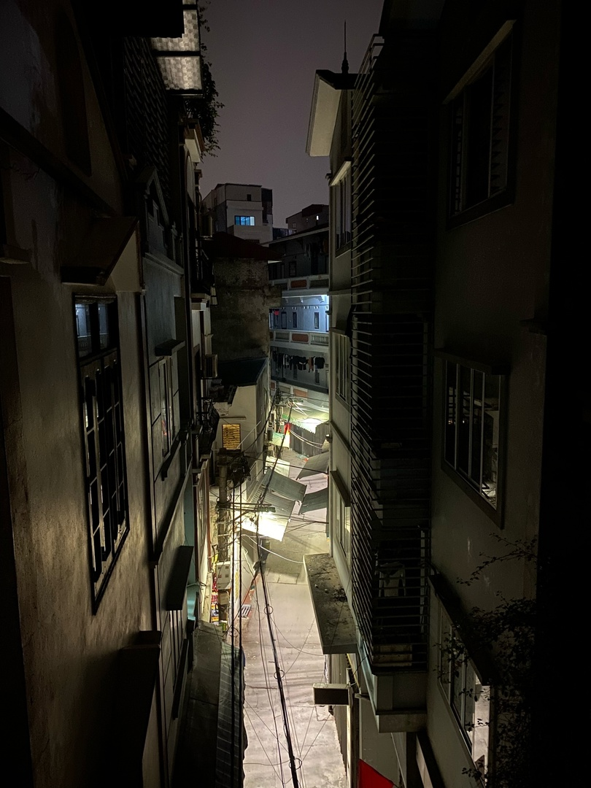

## Инструкция для работы MD

## Выделение текста

Для выделения текста курсивом обрами (*) или знаком нижнего подчеркивания

*Курсив.*

Для выделения текста полужирным обрами (**) или двойным знаком нижнего подчеркивания

**Полужирный.**

Альтернативные способы выделения текста нужны для того,чтобы мы могли совмешать оба способа. Например, _Текст может быть выделен курсивом и **полужирынм**_

## Списки

Чтобы создать конфликт нужно в разных ветках сделать изменения в одном месте

## Работа с изображением

Чтобы вствить изображение в текст,достаточно написать следующее:

## Ссылки

## Работа с таблицами

## Цитаты

## Заключение

